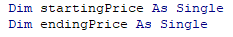
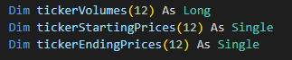
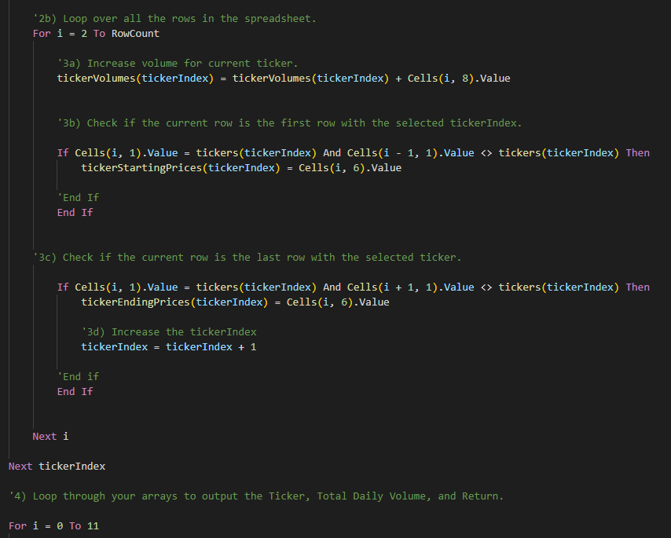
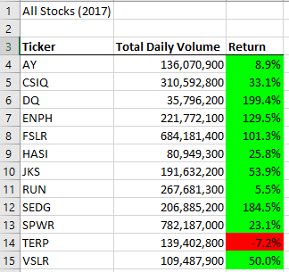
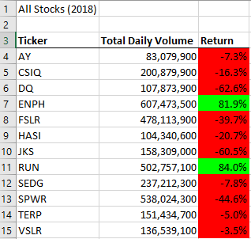
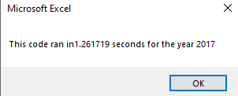
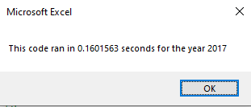
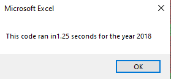
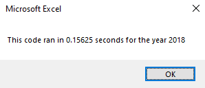

# VBA Green Stock Analysis

## Overview of Project
Originally, Steve had us analyze an Excel file that contained stock data by using
an extension of Excel called VBA. Through this, I created a code that he could run any stock through to analyze! After doing this, he wanted us to expand the dataset so he could include the entire stock market over the past couple of years. To do this, I had to refactor the code to make the script run faster!

## Results
With refactoring code, it took a lot of problem solving/trouble shooting and even asking my peers for help but the end result and having the code actually run was so satisfying. The first step I took was creating a new module for the macro and inputted the outline to have a clean slate. Instead of keeping the two arrays I had in our original code, I created three new ones.

### Original Arrays

### Refactored Arrays

I placed a 'for' loop to run an analysis on the three refactored arrays and also placed 'nested for loops' and variables to loop through our data to get our end result!

### For loop and Nested loops

After running our refactored code, we can see that in 2017 there was a much better outcome of daily volume and return where as in 2018, there was a decline in volume and the only two stocks that stayed in the positive was ENPH and RUN.

### 2017 Stocks

### 2018 Stocks

As for the timing, our message box that we had set up at the end of our refactored code showed us that our code ran about under a second! And seeing the results, it looks like we were able to attain the results for 2018 and 2017 much faster.

### 2017 Original compared to New

### 2018 Original Compared to New

## Summary

### Advantages or Disadvantages of refactoring code and how the apply when refactoring in VBA

Refactoring code can prove to be so useful. As we can see, with refactoring the code we can make our script run much faster. However, when it comes to refactoring code you have to be very careful to not mess up your original code, otherwise you can run into errors. For example, I took my code and first refactored it in VS. I then would place it in a copied version of my workbook and work from there so I wouldn't lose anything in my original file.
It took a lot of help from peers with comparing notes or even having help outside of the classroom with peers in the tech industry to be able to run this code properly!

